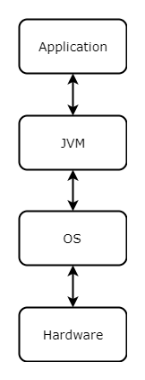
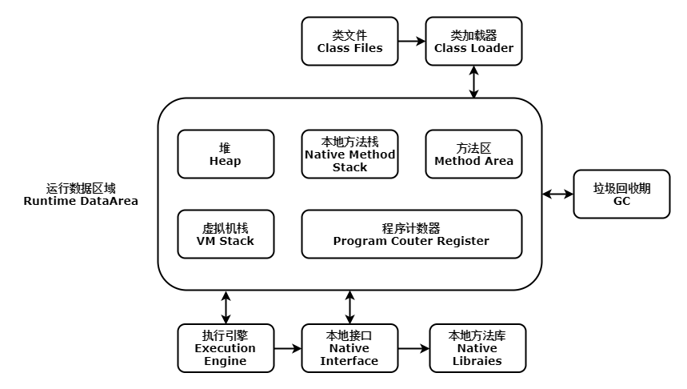

本文介绍了JVM相关知识。内容仅供参考使用，有不足之处请及时指出，也欢迎大家交流探讨。

### JVM

JVM是Java Virtual Machine的缩写，也就是java虚拟机的意思。JVM是一种规范，其作用是将字节码解释为相应的机器指令执行及对程序所需资源的管理和优化。

### JVM 知名实现

##### Sun HotSpot

目前应用最广泛的JVM，起初由Longview Technologies公司开发，97年被Sun收购，首次发布于Sun JDK 1.2，Sun JDK1.3及之后版本的默认虚拟机，2009年Sun公司被Oracle收购。

##### Oracle JRockit

原名Bea JRockit，BEA公司02年从Appeal Virtual Machines收购获得，专注于服务端应用，曾经号称世界上速度最快的虚拟机，BEA公司2008年被Oracle收购。

##### IBM J9

J9是IBM公司开发的虚拟机，其为IBM公司各种产品的执行平台。

##### Sun Classic

该虚拟机是JDK1.0时使用的虚拟机，是各种虚拟机的始祖。

##### Sun Exact

该虚拟机由Sun HotSpot同时期开发，后被Sun HotSpot取代。

### JVM JDK JRE 关系

Java程序设计语言，Java虚拟机，Java API 类库这三部分称为JDK（Java Development Kit）。

JDK是Java开发的最小环境。

Java API类库中的Java SE API子集和Java虚拟机称为JRE（Java Runtime Environment）。

JRE是Java运行的最小环境。

### JVM 组成

##### 类加载器

类加载器负责将符合文件结构的类文件加载到内存中。

##### 执行引擎

执行引擎也叫解释器（Interpreter），类加载后会将指令和数据存放在内存中，执行引擎会解释这些命令并和操作系统做交互，并负责资源的调配（满足程序资源的需要并和提供资源的操作系统协调）。

##### 本地接口

本地接口是为了与其他编程语言做交互设计的。其会在本地方法栈中记录本地方法，在调用本地方法时执行引擎会去加载对应的本地库包。例如Java驱动打印机。不过目前该方法使用并不多，其可以被Socket通信，WebService等方法取代。

### JVM 运行数据区域

JVM在执行程序时会将其管理的内存划分为若干个区域。

##### 程序计数器

线程不共享，每个线程都会有自己的程序计数器，其生命周期和线程一致。如果执行的是字节码方法，计数器中记录的是当前执行指令的地址，如果执行的是Native方法，计数器值为空。程序计数器占用内存很小，该内存区域是JVM规范中唯一一个没有规定任何OutOfMemoryError的区域。

##### 虚拟机栈

线程不共享，每个线程都会有自己的虚拟机栈，虚拟机栈的生命周期与线程同步，栈的内存地址是不连续的。每一个方法调用时都会创建一个栈帧（Stack Frame）来存储局部变量表（基本数据类型和对象引用），操作栈，动态链接，方法出口等信息，每个方法被调用到执行完成会对应一个栈帧的入栈和出栈。栈的大小有两种方式，动态扩展和固定长度，当前大多数JVM为可动态扩展的。

JVM规范中，对该区域定义了两个异常：如果线程请求的栈深度大于虚拟机所允许的深度，则会抛出StackOverflowError异常。如果扩展时无法获得所需的内存，则会抛出OutOfMemoryError异常。

##### 本地方法栈

与虚拟机栈作用相似，只不过服务对象换为了Native方法。Sun HotSpot虚拟机中，本地方法栈和虚拟机栈合二为一。该区域会抛出StackOverflowError和OutOfMemoryError异常。

##### 堆

线程共享，所有线程公用的内存区域，大多数情况下，堆是JVM所管理内存中最大的一块，虚拟机启动时创建，存放对象实例，可以为物理上不连续的内存区域，只要逻辑上连续即可，堆内存大小有俩种方式，动态扩展和固定长度，当前主流的虚拟机都是动态扩展的。堆内存使用不足时，会抛出OutOfMemoryError异常，堆内存被GC管理。

##### 方法区

线程共享，所有线程公用的内存区域，用来存放已被虚拟机加载的类信息，常量，静态变量，即时编译器编译后的代码等。Java虚拟机规范中将该区域描述为堆的一个部分，但该区域的别名为非堆（Non-Heap）。该区域可以使用物理上不连续的内存区域，也可以选择动态扩展或者固定长度，该区域内存不足时，会抛出OutOfMemoryError异常。

HotSpot虚拟机使用永久代（PermanetGeneration）来实现方法区，并将GC分代收集扩展到方法区，GC可以选择不实现。

JDK1.7中，部分永久代的数据迁移到了堆中，例如常量池，静态变量。

JDK1.8中，HotSpot虚拟机使用元空间（Metaspace）替代了永久代，部分原因是为了与JRockit融合，因为JRockit中并没有永久代。元空间不再是JVM内存的一部分，其存在于直接内存中。

### JVM 垃圾回收

垃圾回收简称GC（Garbage Collection），GC会对不再使用的内存进行回收。因为程序计数器，虚拟机栈，本地方法随线程的生命周期一致，故GC针对的是堆和方法区。

##### 引用类型

* 强引用

对象只要存在强引用，GC就不会进行回收。Java中，Object object = new Object()就是强引用。

* 软引用

标识有用但非必须的对象，系统发生内存溢出异常之前，会将该类对象列入回收范围并进行第二次回收。可通过SoftReference类来实现。

* 弱引用

弱引用标识的对象在下一次垃圾回收时回收。当垃圾收集器工作时，无论内存是否足够，都会将弱引用标识的对象。可通过WeakReference类来实现。

* 虚引用

被称为幽灵引用或者幻影引用，其不会对对象的生命周期产生任何影响，其唯一作用就是被虚引用标识的对象被收集器回收时会收到一个系统通知。

##### 判断需要回收的内存

###### 堆（对象）

* 引用计数算法

* 根搜索算法（Java采用的算法）

###### 方法区（废弃常量，无用的类）

* 如果没有任何地方引用常量池中的常量，该常量会被回收。

* 无用类判断标准

    1. 该类的所有实例被回收，堆中不存在其任何实例。

    2. 加载该类的ClassLoader被回收。

    3. 该类的java.lang.Class对象没有在任何地方被引用，无法在任何地方通过反射访问其方法。

##### 垃圾收集算法

* 标记-清除算法

* 复制算法

* 标记-整理算法

* 分代收集算法

##### 垃圾收集器

* Serial 收集器

* ParNew 收集器

* Parallel Scavenge  收集器

* Serial Old 收集器

* Parallel Old 收集器

* CMS 收集器

* G1 收集器
