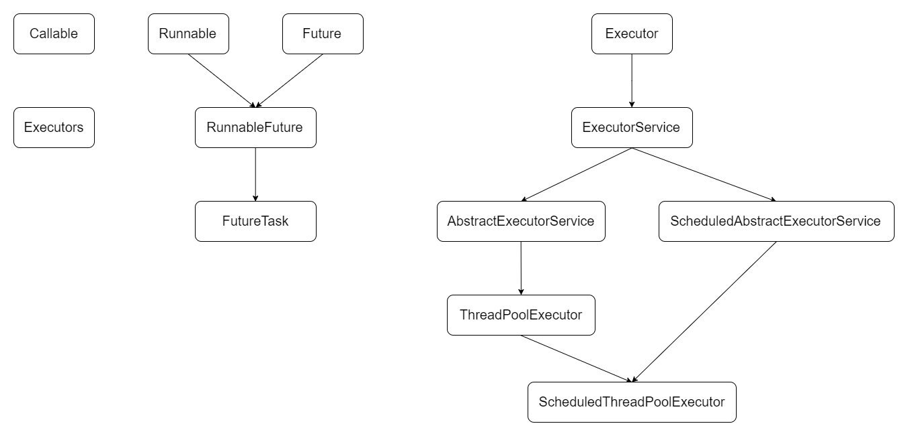

本文介绍了Java-Executor框架相关知识。内容仅供参考使用，有不足之处请及时指出，也欢迎大家交流探讨。

### 概述

Executor是Java 5引入的并发框架，其将任务和执行分离开来。

### Executor两级调度模型

在HotSpot JVM中，Java线程是与本地操作系统线程一一对应的，每个Java线程都对应一个本地操作系统线程。

Java多线程程序是分为两层执行的，上层是由Executor所控制的，其会将任务映射为一定数量的线程，下层是由操作系统内核控制的，其会控制本地线程执行。上层可由应用程序控制，下层则不受应用程序控制。

### Executor框架结构

* 任务

Runnable接口，Callable接口。

* 执行任务

Executor接口及该接口的相关继承者（例如：ExecutorService，ThreadPoolExecutor，ScheduledThreadPoolExecutor）。

* 异步计算结果

Future接口及实现Future的类。

### Executor成员

##### Runnable和Callable

Runnable接口和Callable接口的实现类表示Executor执行的任务，Executors工具类可以将Runnable对象封装为Callable对象。

Runnable不会返回结果，Callable可以返回结果。

##### Executor

Executor框架的基础，其将任务的提交与执行分离。

##### ThreadPoolExecutor

ThreadPoolExecutor是线程池的核心实现类，用来执行提交的任务。

我们可以自定义ThreadPoolExecutor，也可以通过Executors工具类创建，Executor工具类可以创建三种类型的ThreadPoolExecutor。

* FixedThreadPool

固定线程数的线程池。

* SingleThreadExecutor

单个线程的有序的线程池，其可以保证任务按顺序执行。

* CacheThreadPool

线程数无界限的线程池，可以用来执行大量的小任务。

##### ScheduledThreadPoolExecutor

ScheduledThreadPoolExecutor可用来延迟或定时执行任务。

我们可以自定义ScheduledThreadPoolExecutor，也可以通过Executors工具类创建，Executor工具类可以创建两种类型的ScheduledThreadPoolExecutor。

* ScheduledThreadPoolExecutor

多个线程的计划线程池。

* SingleThreadScheduledExecutro

单个线程的有序的计划线程池，其可以保证任务按顺序执行。

##### Future

Future接口和Future接口的实现类表示任务异步执行的结果。

FutureTask除了实现Future接口外还实现了Runnable接口，其也可以被Executor执行。

FutureTask的get方法会等待任务执行完并获取其执行结果。

FutureTask的cancel方法可以以中断任务线程的方式来停止任务的执行。

FutureTask有三种状态，未启动，已启动和已完成。

如果FutureTask处于未启动状态时，调用其取消方法会导致此任务永远不会被执行，如果FutureTask处于已完成状态，调用其取消方法无法取消成功。