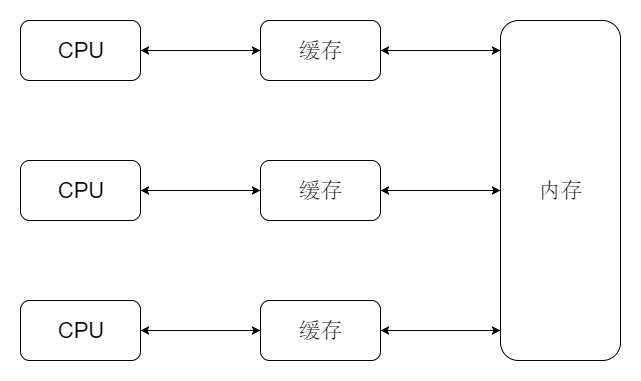
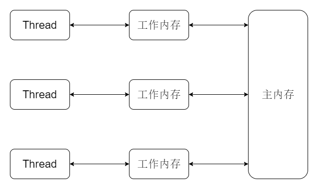
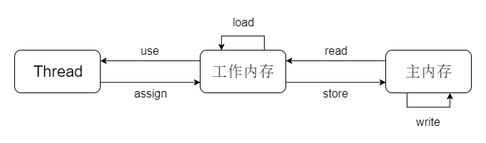

本文介绍了Java内存模型相关知识。内容仅供参考使用，有不足之处请及时指出，也欢迎大家交流探讨。

### 概述

Java内存模型（Java Memory Model，JMM）定义Java应用程序在计算机内存中的工作方式，其屏蔽了不同的硬件和操作系统的差异性，Java应用程序在不同硬件和不同操作系统的计算机内存中的工作方式是一致的。

### 计算机内存体系

在计算机中，为了匹配CPU和内存的处理速度，其采用缓存的机制。

处理器处理数据时，其通常是将缓存中的数据读取到寄存器然后处理，其一般不和内存直接交互，因为两者的速度相差太大，缓存会和内存发生交互。

引入缓存虽然解决了处理器和内存不匹配的问题，但是其又导致了新的问题的产生，例如缓存一致性，执行有序性等问题。

为了解决缓存一致性问题，各个处理器需要遵循一些协议来保证缓存一致性。

CPU会对指令进行重排序来提高执行效率，单核情况下其保证所做的优化不会影响执行结果，但是多核情况下其无法保证执行结果。

### JMM抽象内存模型

为了更好的，更方便的使Java程序解决上述问题，JMM是站在Java应用程序的角度上对计算机内存体系进行抽象的内存模型，其隐藏了不同硬件和操作系统的差异性，Java应用程序只需要关心JMM即可，至于不同的硬件和操作系统如何处理则交给JVM。

JMM规定所有的变量只存储在主内存中，每个线程都有自己的工作内存，线程不能操作主内存，其只能操作工作内存，线程需要用到变量时，需要将其先移动到工作内存中，然后再处理。

##### JMM内存交互指令

|名称|作用|
|:----:|:----:|
|read|将数据从主内存传输到工作内存中|
|load|将传输过来的数据写入到工作内存中对应的变量副本中|
|use|将工作内存中变量的值传输到执行引擎中|
|assign|将执行引擎中变量的值传输到工作内存中|
|store|将工作内存中变量的值传输到主内存中|
|write|将传输过来的数据写入到主内存中对应的变量中|
|lock|作用于主内存，可以将主内存的变量标识为线程独占状态|
|unlock|作用于主内存，其可以将被lock锁定的变量解锁|

* 原子性

JMM保证了上述这些指令为原子性的，但是JMM允许对没有被violate修饰的64位数据（long，double）的读写操作分为两次32位的读写操作。

Java也提供了原子操作类来进行一些原子操作。

* 可见性

可见性可以通过violate，synchronized，final来实现。

* 有序性

有序性可以通过violate，synchronized来实现。