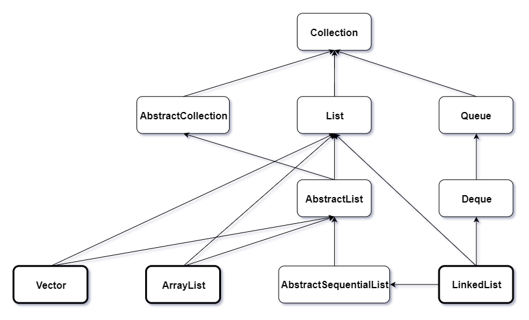

本文介绍了java-list容器相关知识。内容仅供参考使用，有不足之处请及时指出，也欢迎大家交流探讨。

### 容器

Java容器是用来存储和管理对象，其弥补了数组的不足之处。

### List容器相关类图



##### Collection

集合基础接口，其代表一组对象，对象在Collection中被称为Element。

##### List

有序集合。


##### Queue

队列集合。

### ArrayList

ArrayList本质是一个长度可变的数组。

* ArrayList构造器部分源码

```
public ArrayList() {
    this.elementData = DEFAULTCAPACITY_EMPTY_ELEMENTDATA;
}

transient Object[] elementData;

private static final Object[] DEFAULTCAPACITY_EMPTY_ELEMENTDATA = {};
```

* ArrayList添加元素部分源码

```
public boolean add(E e) {
    ensureCapacityInternal(size + 1);
    elementData[size++] = e;
    return true;
}

private int size;

private void ensureCapacityInternal(int minCapacity) {
    ensureExplicitCapacity(calculateCapacity(elementData, minCapacity));
}

private static int calculateCapacity(Object[] elementData, int minCapacity) {
    if (elementData == DEFAULTCAPACITY_EMPTY_ELEMENTDATA) {
        return Math.max(DEFAULT_CAPACITY, minCapacity);
    }
    return minCapacity;
}

private static final int DEFAULT_CAPACITY = 10;

private void ensureExplicitCapacity(int minCapacity) {
    modCount++;

    if (minCapacity - elementData.length > 0)
        grow(minCapacity);
}

protected transient int modCount = 0;

transient Object[] elementData;

private void grow(int minCapacity) {
    int oldCapacity = elementData.length;
    int newCapacity = oldCapacity + (oldCapacity >> 1);
    if (newCapacity - minCapacity < 0)
        newCapacity = minCapacity;
    if (newCapacity - MAX_ARRAY_SIZE > 0)
        newCapacity = hugeCapacity(minCapacity);
    elementData = Arrays.copyOf(elementData, newCapacity);
}

private static int hugeCapacity(int minCapacity) {
    if (minCapacity < 0)
        throw new OutOfMemoryError();
    return (minCapacity > MAX_ARRAY_SIZE) ?
            Integer.MAX_VALUE :
            MAX_ARRAY_SIZE;
}

private static final int MAX_ARRAY_SIZE = Integer.MAX_VALUE - 8;
```

每当往ArrayList添加元素时，其会判断数组当前容量是否可以存储下，如果存储不下则对数组进行扩容，扩容后将原数组复制到扩容后的新数组中，然后将添加的元素添加到新数组中。

ArrayList受int影响，长度有最大限制。

* ArrayList获取元素部分源码

```
public E get(int index) {
    rangeCheck(index);

    return elementData(index);
}

private void rangeCheck(int index) {
    if (index >= size)
        throw new IndexOutOfBoundsException(outOfBoundsMsg(index));
}

private int size;

private String outOfBoundsMsg(int index) {
    return "Index: "+index+", Size: "+size;
}

E elementData(int index) {
    return (E) elementData[index];
}

transient Object[] elementData;
```

从ArrayList中获取元素时，其会先判断获取元素的序号是否超过了数组的size，超过则抛出异常，没有超过则返回数组中对应下标的数据。

* ArrayList移除元素部分源码

```
public E remove(int index) {
    rangeCheck(index);

    modCount++;
    E oldValue = elementData(index);

    int numMoved = size - index - 1;
    if (numMoved > 0)
        System.arraycopy(elementData, index+1, elementData, index,
                numMoved);
    elementData[--size] = null;

    return oldValue;
}

private void rangeCheck(int index) {
    if (index >= size)
        throw new IndexOutOfBoundsException(outOfBoundsMsg(index));
}

private int size;

private String outOfBoundsMsg(int index) {
    return "Index: "+index+", Size: "+size;
}

protected transient int modCount = 0;

E elementData(int index) {
    return (E) elementData[index];
}

transient Object[] elementData;
```

从ArrayList中移除元素时，其会先判断获取元素的序号是否超过了数组的size，超过则抛出异常，没有超过则通过数组复制的方法将对应下标的数据清除掉。

* 总结

因为ArrayList是基于数组实现的，所以其查询速度很快，但是其添加元素时，如果数组存储空间不足，会涉及到数组的创建，数组的复制，在其移除元素时，会涉及到数组的复制，所以其添加移除元素的效率不高。

ArrayList的长度有最大值。

通过源码可知，ArrayList是线程不安全的。

### Vector

Vector本质是一个长度可变的数组。

* Vector构造器部分源码

```
public Vector() {
    this(10);
}

public Vector(int initialCapacity) {
    this(initialCapacity, 0);
}

public Vector(int initialCapacity, int capacityIncrement) {
    super();
    if (initialCapacity < 0)
        throw new IllegalArgumentException("Illegal Capacity: "+
                                           initialCapacity);
    this.elementData = new Object[initialCapacity];
    this.capacityIncrement = capacityIncrement;
}

protected Object[] elementData;

protected int capacityIncrement;
```

Vector在初始化时便会构建一个长度为10的数组。

* Vector添加元素部分源码

```
public synchronized boolean add(E e) {
    modCount++;
    ensureCapacityHelper(elementCount + 1);
    elementData[elementCount++] = e;
    return true;
}

protected transient int modCount = 0;

protected int elementCount;

private void ensureCapacityHelper(int minCapacity) {
    if (minCapacity - elementData.length > 0)
        grow(minCapacity);
}

protected Object[] elementData;

private void grow(int minCapacity) {
    int oldCapacity = elementData.length;
    int newCapacity = oldCapacity + ((capacityIncrement > 0) ?
                                     capacityIncrement : oldCapacity);
    if (newCapacity - minCapacity < 0)
        newCapacity = minCapacity;
    if (newCapacity - MAX_ARRAY_SIZE > 0)
        newCapacity = hugeCapacity(minCapacity);
    elementData = Arrays.copyOf(elementData, newCapacity);
}

protected int capacityIncrement;

private static final int MAX_ARRAY_SIZE = Integer.MAX_VALUE - 8;

private static int hugeCapacity(int minCapacity) {
    if (minCapacity < 0)
        throw new OutOfMemoryError();
    return (minCapacity > MAX_ARRAY_SIZE) ?
        Integer.MAX_VALUE :
        MAX_ARRAY_SIZE;
}

protected int elementCount;
```

每当往Vector添加元素时，其会判断数组当前容量是否可以存储下，如果存储不下则对数组进行扩容，扩容后将原数组复制到扩容后的新数组中，然后将添加的元素添加到新数组中。

Vector受int影响，长度有最大限制。

* Vector获取元素部分源码

```
public synchronized E get(int index) {
    if (index >= elementCount)
        throw new ArrayIndexOutOfBoundsException(index);

    return elementData(index);
}

protected int elementCount;

E elementData(int index) {
    return (E) elementData[index];
}

protected Object[] elementData;
```

从Vector中获取元素时，其会先判断获取元素的序号是否超过了数组的size，超过则抛出异常，没有超过则返回数组中对应下标的数据。

* Vector移除元素部分源码

```
public synchronized E remove(int index) {
    modCount++;
    if (index >= elementCount)
        throw new ArrayIndexOutOfBoundsException(index);
    E oldValue = elementData(index);

    int numMoved = elementCount - index - 1;
    if (numMoved > 0)
        System.arraycopy(elementData, index+1, elementData, index,
                         numMoved);
    elementData[--elementCount] = null;

    return oldValue;
}

protected transient int modCount = 0;

protected int elementCount;

E elementData(int index) {
    return (E) elementData[index];
}

protected Object[] elementData;
```

从Vector中移除元素时，其会先判断获取元素的序号是否超过了数组的size，超过则抛出异常，没有超过则通过数组复制的方法将对应下标的数据清除掉。

* 总结

Vector从源码上看，基本和ArrayList是一样的，其和ArrayList的区别是Vector的方法用synchronized进行了修饰，所以其是线程安全的。

### LinkedList

LinkedList本质是一个链表。

* LinkedList构造器部分源码

```
public LinkedList() {
}
```

* LinkedList添加元素部分源码

```
public boolean add(E e) {
    linkLast(e);
    return true;
}

void linkLast(E e) {
    final Node<E> l = last;
    final Node<E> newNode = new Node<>(l, e, null);
    last = newNode;
    if (l == null)
        first = newNode;
    else
        l.next = newNode;
    size++;
    modCount++;
}

private static class Node<E> {
    E item;
    Node<E> next;
    Node<E> prev;

    Node(Node<E> prev, E element, Node<E> next) {
        this.item = element;
        this.next = next;
        this.prev = prev;
    }
}

transient Node<E> last;

transient Node<E> first;

transient int size = 0;

protected transient int modCount = 0;
```

每当往LinkedList添加元素时，会初始化一个包含该元素数据，prev节点为last，next节点为null的节点，然后判断LinkedList的last节点是否为null，如果为null，将该节点赋值给last和first，如果不为null，将该节点赋值给last的next,然后将该节点赋值给last。

* LinkedList获取元素部分源码

```
public E get(int index) {
    checkElementIndex(index);
    return node(index).item;
}

private void checkElementIndex(int index) {
    if (!isElementIndex(index))
        throw new IndexOutOfBoundsException(outOfBoundsMsg(index));
}

private boolean isElementIndex(int index) {
    return index >= 0 && index < size;
}

transient int size = 0;

private String outOfBoundsMsg(int index) {
    return "Index: "+index+", Size: "+size;
}

Node<E> node(int index) {

    if (index < (size >> 1)) {
        Node<E> x = first;
        for (int i = 0; i < index; i++)
            x = x.next;
        return x;
    } else {
        Node<E> x = last;
        for (int i = size - 1; i > index; i--)
            x = x.prev;
        return x;
    }
}

private static class Node<E> {
    E item;
    Node<E> next;
    Node<E> prev;

    Node(Node<E> prev, E element, Node<E> next) {
        this.item = element;
        this.next = next;
        this.prev = prev;
    }
}
```

从LinkedList中获取元素时，先判断获取元素的序号是否正确，然后判断获取元素的序号在链表的前半截还是后半截，如果是在前半截，则从头开始获取，如果是在后半截，则从尾开始获取。

* LinkedList移除元素部分源码

```
public E remove(int index) {
    checkElementIndex(index);
    return unlink(node(index));
}

private void checkElementIndex(int index) {
    if (!isElementIndex(index))
        throw new IndexOutOfBoundsException(outOfBoundsMsg(index));
}

private boolean isElementIndex(int index) {
    return index >= 0 && index < size;
}

transient int size = 0;

private String outOfBoundsMsg(int index) {
    return "Index: "+index+", Size: "+size;
}

Node<E> node(int index) {

    if (index < (size >> 1)) {
        Node<E> x = first;
        for (int i = 0; i < index; i++)
            x = x.next;
        return x;
    } else {
        Node<E> x = last;
        for (int i = size - 1; i > index; i--)
            x = x.prev;
        return x;
    }
}

private static class Node<E> {
    E item;
    Node<E> next;
    Node<E> prev;

    Node(Node<E> prev, E element, Node<E> next) {
        this.item = element;
        this.next = next;
        this.prev = prev;
    }
}

E unlink(Node<E> x) {
    final E element = x.item;
    final Node<E> next = x.next;
    final Node<E> prev = x.prev;

    if (prev == null) {
        first = next;
    } else {
        prev.next = next;
        x.prev = null;
    }

    if (next == null) {
        last = prev;
    } else {
        next.prev = prev;
        x.next = null;
    }

    x.item = null;
    size--;
    modCount++;
    return element;
}

transient Node<E> first;

transient Node<E> last;

transient int size = 0;

protected transient int modCount = 0;
```

从LinkedList中移除元素时，先判断获取元素的序号是否正确，然后查找到该节点，判断该节点是否为第一个节点，如果该节点为第一个节点，则将该节点的next赋值给first，如果该节点不是第一个节点，则将其next赋值给其prev的next，并将其prev变为null,接下来继续判断该节点是否为最后一个节点，如果该节点为最后一个节点，则将该节点的prev赋值给last，如果该节点不是最后一个节点，则将其prev赋值给next的prev，并将其next变为null，最后返回该节点的item。

* 总结

LinkedList是基于链表实现的，其添加元素时，只需改变一些节点的属性即可，所以其添加元素的效率很高，其获取元素时，需要从头或从尾开始依次遍历查找，效率不高。其移除元素时，需要先要获取到该元素，然后再改变一些节点的属性，效率更不高。

### 备注

本文所涉及Java源码对应Java版本为1.8.0_162。