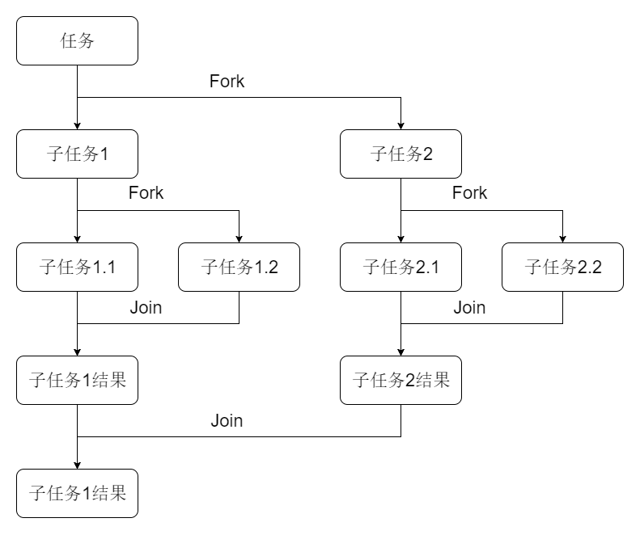
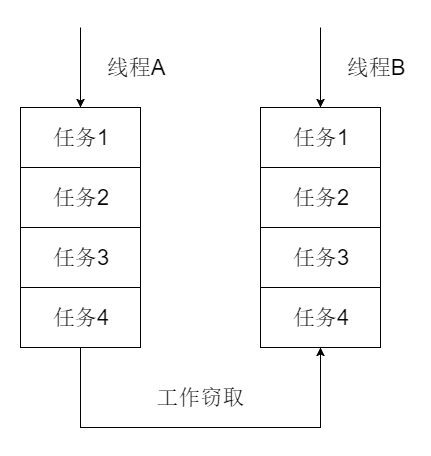

### 概述

Fork/Join框架是Java 7中新增的一个用于并行执行任务的框架，其可以将任务拆分为多个子任务并分线程执行，然后再将子任务执行结果进行汇总得到任务执行结果。

### Fork/Join运行流程示例图



### 工作窃取算法

工作窃取（work-stealing）算法是指线程从其他线程工作队列中获取任务来执行的策略。

Fork/Join框架执行时，会将任务拆分为多个子任务，这些子任务会存放在不同的队列中，每个队列都有单独的线程去执行，但是线程执行完自身队列中任务耗时是不同的，先执行完自身队列中任务的线程会去其他线程工作队列中获取任务去执行，为了避免窃取线程和被窃取线程发生竞争，工作队列往往采用双端队列，被窃取任务线程从双端队列的头部获取任务，窃取任务线程从双端队列的尾部获取任务，但是这样不能完全避免竞争，双端队列只剩一个任务时，还是会发生竞争。



### Fork/Join框架结构

* ForkJoinTask

ForkJoin任务，提供了Fork和Join方法，一般情况下，我们不需要直接继承ForkJoinTask，只需要继承其子类即可。

RecursiveAction表示无返回结果的ForkJoin任务，RecursiveTask表示有返回结果的ForkJoin任务。

* ForkJoinPool

执行ForkJoin任务。

其由ForkJoinTask数组和ForkJoinWorkerThread数组组成，ForkJoinTask数组负责存放提交给ForkJoinPool的任务，ForkJoinWorkerThread数组负责执行这些任务。

### Fork/Join框架示例

计算从1加到500000000

``` java
public class SumTask extends RecursiveTask<BigDecimal> {

    private static final BigDecimal THRESHOLD = new BigDecimal(100000000);

    private BigDecimal start;
    private BigDecimal end;

    public SumTask(BigDecimal start, BigDecimal end) {
        this.start = start;
        this.end = end;
    }

    @Override
    protected BigDecimal compute() {

        if (end.subtract(start).compareTo(THRESHOLD) <= 0) {

            BigDecimal sum = BigDecimal.ZERO;
            for (int i = start.intValue(); i <= end.intValue(); i++) {
                sum = sum.add(new BigDecimal(i));
            }
            return sum;
        }

        BigDecimal middle = start.add(end).divide(new BigDecimal(2));
        SumTask leftSubSumTask = new SumTask(start, middle);
        SumTask rightSubSumTask = new SumTask(middle.add(BigDecimal.ONE), end);
        // 该方法会保留一个任务给当前线程执行
        invokeAll(leftSubSumTask, rightSubSumTask);
        return leftSubSumTask.join().add(rightSubSumTask.join());
    }
}
```

``` java
ForkJoinPool forkJoinPool = new ForkJoinPool(100);
System.out.println(forkJoinPool.invoke(new SumTask(new BigDecimal(1), new BigDecimal(500000000))));
```

``` text
125000000250000000
```

* 异常处理

``` java
// 判断任务是否发生了异常
task.isCompletedAbnormally();
// 获取任务中发生的异常
task.getException();
```