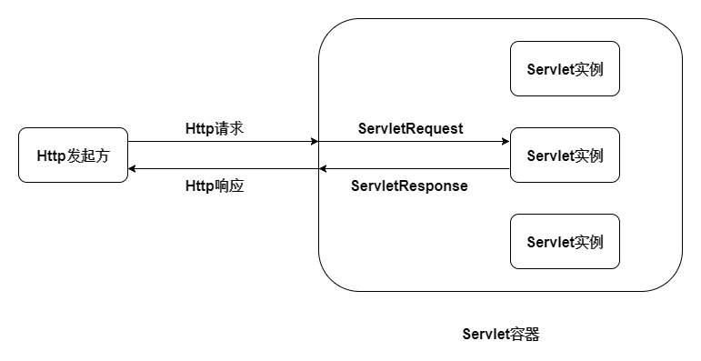

本文介绍了Java Servlet基本知识。内容仅供参考使用，有不足之处请及时指出，也欢迎大家交流探讨。

### 概述

Servlet是运行在服务端处理Http请求的程序。

### Servlet与CGI对比

* Servlet性能更好

CGI（Common Gateway Interface）公共网管接口需要为每个请求创建一个进程来运行相应的处理程序，资源开销较大。Servlet只需启动JVM加载运行相应的程序即可，只有一个进程，资源开销相对较小。

* Servlet使用更方便

CGI需要重复编写处理网络协议，编码等的编码，Servlet可以复用处理网络协议，编码等的编码。

##### PS

Fast CGI已解决了CGI性能上的不足，现在应用CGI技术的应用还是存在的。

### Servlet容器

Servlet需要运行在Servlet容器中，Servlet容器处理Http请求流程如下。



### Servlet生命周期

##### Servlet接口方法

* init

Servlet容器在初始化Servlet时调用。

* service

该方法在处理Servlet请求时调用。

* destroy

该方法在Servlet生命周期结束时调用。

* getServletConfig

* getServletInfo

##### ServletConfig接口方法

* getServletName

* getServletContext

* getInitParameter

* getInitParameterNames

##### Servlet活动

Servlet在Servlet容器加载其时调用init方法初始化实例，通过service方法处理相应的Servlet请求，在容器关闭或对应项目移除时，Servlet容器会调用destroy方法将其实例销毁，init方法和destroy方法只会被调用一次。

### Servlet实现

##### 实现Servlet接口

##### 继承GenericServlet类

GenericServlet类是实现了Servlet的抽象类，在Servlet的基础上提供了更多的方法，并实现了Servlet的部分方法。

##### 继承HttpServlet类

GenericServlet类是继承了GenericServlet的抽象类，在GenericServlet的基础上进一步封装。

### 转发和重定向

转发是服务端内部的行为，重定向是客户端行为。

转发是服务端内部的跳转，客户端不会有感知。

重定向是客户端行为，客户端发送请求后，服务端会返回相应的状态码（301，302）并告知相关URL，客户端会发起新的请求。

转发可以隐藏内部细节，根据传参的不同，服务端内部跳转到相应的模块，重定向一般用于注销完毕后的跳转。

### GET和POST

GET是从服务端获取资源，POST是向服务端提交数据。

GET传输的数据存放在URL中，POST的数据存放在请求头或请求数据中。

GET传输的数据受URL最大长度影响（2048个字符），GET使用MIME类型（application/x-www-form-urlencoded）的URL编码（百分号编码）。

### Servlet Demo

* servlet-demo项目结构

``` text
src
--main
----java
------DemoServlet
----webapp
------WEB-INF
--------web.xml
build.gradle
```

* DemoServlet

``` java
public class DemoServlet extends HttpServlet {

    @Override
    public void doGet(HttpServletRequest req, HttpServletResponse resp) throws IOException {
        String display = req.getParameter("display");
        PrintWriter printWriter = resp.getWriter();
        printWriter.print(display);
    }
}
```

* web.xml

``` xml
<?xml version="1.0" encoding="UTF-8"?>
<web-app xmlns="http://xmlns.jcp.org/xml/ns/javaee" xmlns:xsi="http://www.w3.org/2001/XMLSchema-instance"
         xsi:schemaLocation="http://xmlns.jcp.org/xml/ns/javaee
         http://xmlns.jcp.org/xml/ns/javaee/web-app_3_1.xsd"
         version="3.1">

    <servlet>
        <servlet-name>demoServlet</servlet-name>
        <servlet-class>DemoServlet</servlet-class>
    </servlet>
    <servlet-mapping>
        <servlet-name>demoServlet</servlet-name>
        <url-pattern>/demo</url-pattern>
    </servlet-mapping>
</web-app>
```

* build.gradle

``` groovy
apply plugin: 'java'
apply plugin: 'war'

repositories {
    mavenCentral()
}

dependencies {
    compile("javax.servlet:javax.servlet-api:4.0.1")
}
```

通过tomcat启动，访问http://localhost:8080/servlet-demo/demo?display=hello%20world!

* 网页显示

``` text
hello world!
```