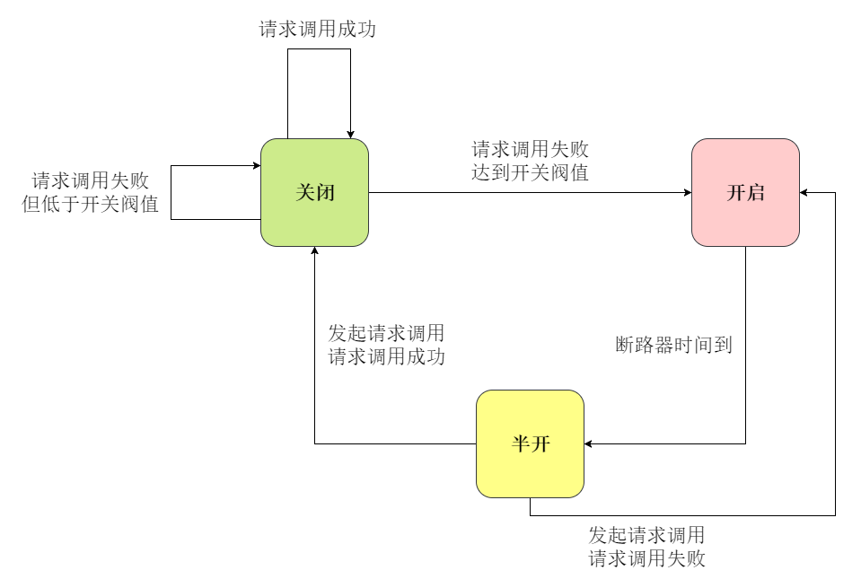

本文介绍了Hystrix与微服务容错处理相关知识。内容仅供参考使用，有不足之处请及时指出，也欢迎大家交流探讨。

### 微服务容错处理

##### 雪崩效应

微服务是由多个服务组成的应用系统，各个服务之间难免存在依赖关系，当一个服务故障时，其会影响依赖其的服务，造成其不可用，如此下去可能会造成一系列的服务不可用，这种由基础服务故障造成的级联故障称为雪崩效应。

##### 容错处理

* 设置超时时间

为网络请求设置超时时间，当服务不可用，尽快结束该次网络请求，从而释放该请求对应的进程或线程，进而释放进程或线程占用的系统资源。

* 设置断路器

断路器在服务提供者发生故障时可以断绝对其的请求，直接返回，通过实现快速返回进而快速释放对应的进程或线程，进而释放进程或线程占用的系统资源。



正常情况下，断路器关闭，正常请求调用服务。

当请求调用某个服务失败并达到开关阀值（例如错误率，每分钟错误笔数等）时，断路器开启，不再发起请求调用。

当断路器开启一段时间后，断路器变为半开状态，此时会发起请求调用，如调用成功，断路器关闭，如调用失败，断路器开启。

### Hystrix

Hystrix是Netflix开源的容错处理工具类库。

##### Hystrix特点

* 包裹处理

Hystrix使用了命令模式设计模式，其将每个请求调用包裹成命令，默认情况下，每个命令在独立线程中执行。

* 断路机制

当请求调用某个服务错误达到阀值后，Hystrix可自动或手动断路，暂时停止请求调用该服务。

* 资源隔离

默认情况下，Hystrix为每个请求调用的服务都维护了一个线程池，如果该线程池已满，发送该服务的请求调用会被拒绝，直接返回，而不是排队等候。

* 监控

Hystrix可以近乎实时的监控运行指标（例如成功，失败，超时，被拒绝的请求等）和配置的变化。

* 回退机制

当请求失败，超时，被拒绝或断路器开启时，Hystrix会执行回退机制，回退逻辑可由开发人员自定义。

* 自我修复

断路器开启一段时间后，会自动进入半开状态，然后判断接下来的请求调用，如调用成功，断路器关闭，如调用失败，断路器开启。

### Spring Cloud整合Eureka，Ribbon，Feign，Hystrix

##### Hystrix Spring Cloud依赖包

``` groovy
compile("org.springframework.cloud:spring-cloud-starter-netflix-hystrix")
```

Feign依赖包中已包含了其所需的Hystrix依赖。

##### 启动类

``` java
@EnableFeignClients
@EnableHystrix
@SpringBootApplication
public class EurekaRibbonFeignHystrixConsumerApplication {

    public static void main(String[] args) {
        SpringApplication.run(EurekaRibbonFeignHystrixConsumerApplication.class, args);
    }
}
```

##### Feign开启熔断配置

``` yml
feign:
  hystrix:
    enabled: true
```

##### 为feign指定回退

``` java
@FeignClient(name = "eurekaProvider", fallbackFactory = EurekaProviderFeignClientHystrixFallbackFactory.class)
@RequestMapping("calculation")
public interface EurekaProviderFeignClient {

    @GetMapping("add")
    CalculationResult add(@RequestParam("paramOne") BigDecimal paramOne, @RequestParam("paramTwo") BigDecimal paramTwo);
}
```

``` java
@Slf4j
@Component
public class EurekaProviderFeignClientHystrixFallbackFactory implements FallbackFactory<EurekaProviderFeignClient> {

    @Override
    public EurekaProviderFeignClient create(Throwable cause) {

        return new EurekaProviderFeignClient() {

            @Override
            public CalculationResult add(BigDecimal paramOne, BigDecimal paramTwo) {
                log.error("回退原因：", cause);
                CalculationResult calculationResult = new CalculationResult();
                calculationResult.setParamOne(paramOne);
                calculationResult.setParamTwo(paramTwo);
                return calculationResult;
            }
        };
    }
}
```

这里也可以不使用FallbackFactory，使用如下方式也可以指定回退。

``` java
@FeignClient(name = "eurekaProvider", fallback = EurekaProviderFeignClientHystrixFallback.class)
```

``` java
@Component
//为了解决相同路径Spring初始化报错
@RequestMapping("calculationNeverAccess")
public class EurekaProviderFeignClientHystrixFallback implements EurekaProviderFeignClient {

    @Override
    public CalculationResult add(@RequestParam("paramOne") BigDecimal paramOne, @RequestParam("paramTwo") BigDecimal paramTwo) {

        CalculationResult calculationResult = new CalculationResult();
        calculationResult.setParamOne(paramOne);
        calculationResult.setParamTwo(paramTwo);
        return calculationResult;
    }
}
```

推荐使用FallbackFactory，因为其可以获取到回退的原因。

发生异常（HystrixBadRequestException例外，该异常也不会被Hystrix认为失败，其可以继续往外抛）时触发回退，也可以通过配置使指定的异常不发生回退。

发生回退不代表断路器打开。请求失败，超时，被拒绝或断路器开启都会触发回退。

##### Feign禁用Hystrix

* 全局禁用

``` yml
feign:
  hystrix:
    enabled: false
```

* 单独的客户端禁用

``` java
@FeignClient(name = "eurekaProvider", configuration = EurekaProviderFeignDisableHystrixConfig.class)
```

``` java
@Configuration
public class EurekaProviderFeignDisableHystrixConfig {

    @Bean
    @Scope("prototype")
    public Feign.Builder feignBuilder() {
        return Feign.builder();
    }
}
```

### Hystrix线程隔离策略

Hystrix有俩种隔离策略，线程隔离和信号量隔离。

* THREAD

该方式下，HystrixCommand会在独立的线程上执行，并发请求受线程池中线程数的影响。

* SEMAPHORE

该方式下，HystrixCommand将在原调用线程上执行，开销较小，并发请求受信号量个数的限制。

Hystrix推荐使用线程隔离，因为该方式有除网络超时以外的额外保护层，但是当调用负载很高时，需要使用信号量隔离，因为线程隔离的开销会很大。

使用线程隔离策略时，如发生找不到上下文的异常，可以考虑使用信号量隔离策略。