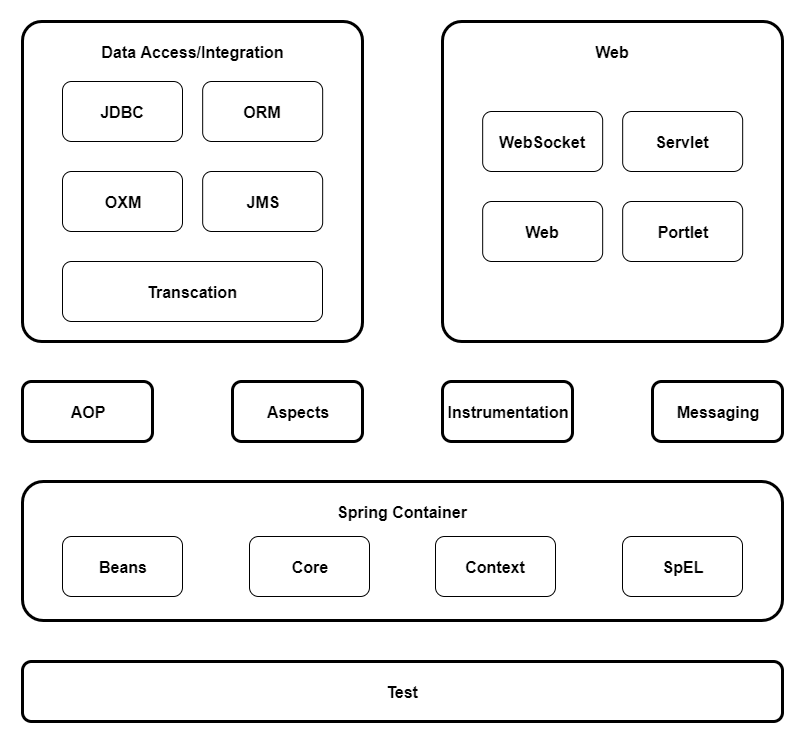

本文介绍了Spring框架的基本知识。内容仅供参考使用，有不足之处请及时指出，也欢迎大家交流探讨。

### 概述

Spring是一个开源的Java应用框架，其使Java开发变得更加简单，使得开发人员可以将更多的精力放在业务的实现。

Spring框架包含很多的模块，你可以根据需要选择合适的模块。

### Spring 4.x 框架结构图

### Spring Container

Spring Container提供了Spring框架的基本功能，其由Beans，Core，Context，SpEL组成。

##### Spring-core模块

提供了Spring的一些核心基本工具，例如DI的基本实现。

##### spring-Beans模块

Bean的定义（封装Object），Bean的创建，Bean的解析

##### spring-context模块

Spring的IOC容器。

##### spring-expression模块

Spring Express Language（SpEL），Spring表达式语言。

### spring-aop模块

提供了一个可以自己定义的符合AOP Alliance规范的面向切面实现。

### spring-aspects模块

提供了与AspectJ的集成。

### spring-instrument模块

提供了特定服务器的类工具支持及类加载器实现。

### spring-messaging模块

提供了消息传递的基础组件。

### Data Access/Integration

##### spring-jdbc模块

提供了一个JDBC抽象层以简化开发。

##### spring-orm模块

提供了主流的对象关系映射框架，例如JPA，JDO，Hibernate，iBatis。

##### spring-oxm模块

提供了一个实现对象，XML映射的抽象层，例如JAXB，Castor，XMLBeans，JiBx，XStream。

##### spring-jms模块

提供了消息生产和消息消费的服务。

##### spring-tx模块

支持编程式和声明式事务管理。

### Web

##### spring-websocket模块

提供了对web socket的支持。

##### spring-Servlet模块

也叫spring-webmvc模块，提供了web应用的MVC结构实现和Rest实现。

##### spring-web模块

提供了基础的Web功能。

##### spring-Portlet模块

也叫spring-web-mvc-portlet，提供了Web应用在Portlet环境中的MVC结构实现。

### test模块

提供了spring测试所需的功能。