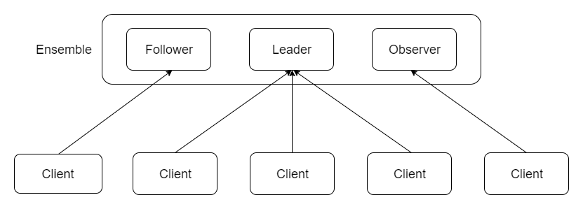
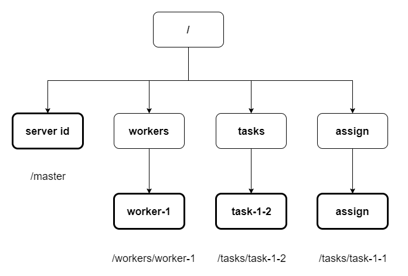

本文介绍了Zookeeper基本知识。内容仅供参考使用，有不足之处请及时指出，也欢迎大家交流探讨。

### 概述

Zookeeper是一个分布式调度服务，其是Google的Chubby项目的开源实现，以Fast Paxos算法为基础，并在Fast Paxos算法基础上进行了优化，其曾经是Hadoop的子项目。

### 分布式系统

分布式系统是指在集群内，为了完成相同任务而互相协调的节点所组成的系统。

分布式系统分为服务端和客户端。

分布式系统具有高可靠，扩展性强的优点。

### Zookeeper结构

|名字|说明|
|:----|:----|
|Client|Zookeeper客户端|
|Ensemble|Zookeeper服务器组，最小的节点为3个|
|Leader|主节点|
|Follower|从节点|
|Observer|观察者，不参于投票|

### Zookeeper数据模型

Zookeeper维护一个具有层次结构（树）的数据结构，其中的每个节点称为Znode。

|节点|说明|
|:----|:----|
|/workers|该节点下面的每个节点保存了系统中的可用节点的信息|
|/tasks|该节点下面的每个节点保存了已创建并等待节点执行的任务的信息|
|/assign|该节点下面的每个节点保存了已分配到节点任务的信息|

节点路径需用绝对路径表示，Zookeeper支持节点的增删修改查。

Zookeeper不适合保存大量数据，其规定每个节点的数据大小不得超过1M，所以使用时应将应用数据和协同数据独立开，Zookeeper应保存应用协作的关键数据，也就是协同数据（元数据）。

Zookeeper保证了节点的数据读写都是原子操作，每次读写都是对数据的完整读取或完整写入。

##### Znode类型

* 持久节点和临时节点

持久节点可以永久保存除非客户端发出命令删除，临时节点依赖于客户端会话，一旦会话结束，临时节点会被删除，临时节点也可以被客户端发出命令删除，临时节点不能拥有子节点。

* 有序节点

当创建有序节点时，Zookeeper会自动为其分配一个序号并追加到路径后面。

##### Znode结构

* stat

状态信息，由版本号，操作控制列表（ACL），时间戳和数据长度组成。

* data

该Znode存储的数据信息。

* children

该节点的下属子节点。

##### Znode时间管理

* 时间戳

节点的每次操作都会生成一个Zxid格式的时间戳，该时间戳唯一且全局有序。

|时间戳|说明|
|:----|:----|
|cZxid|节点创建时对应的Zxid格式时间戳|
|mZxid|节点修改时对应的Zxid格式时间戳|
|pZxid|节点最新修改对应的Zxid格式时间戳|

* 版本号

每一个Znode都维护版本号，其随每次对应数据的变化而自增，通过版本号可以阻止并行操作的不一致性。

|版本号|对应数据说明|
|:----|:----|
|version|节点|
|cversion|节点的子节点|
|aversion|节点的ACL|

### 监视与通知

Zookeeper为了避免轮询的发生，其使用了基于通知的机制，客户端可以通过Zookeeper在Znode上注册一些watch，在指定的情况发生时，watch会触发一个通知，该通知会通知客户端。

Zookeeper通知机制是先向客户端传送通知，然后再进行变更。

客户端设置新的监视点时，在设置新节点前会去查看原监视点的状态，并作出通知。

### Zookeeper模式

* standalone

单独的一台服务器。

* quorom

存在一组服务器，称为Zookeeper ensemble。

由于存在多个节点，所以Zookeeper需要同步各个节点的数据树，但是如果客户端需等待每个节点都同步完数据再继续，延迟十分高，因此Zookeeper提出了法定人数的概念。

法定人数在Zookeeper中是指Zookeeper保证有效运行的最小节点数量，当有法定人数个节点完成数据同步，客户端就可以继续执行。

### 会话

会话是客户端与Zookeeper通信的关键，客户端必须先与Zookeeper服务端建立会话，然后才能发送各种请求。

会话中的请求会以FIFO（先进先出）顺序执行，但是不保证多个会话中的请求顺序。

客户端以特定的时间间隔发送心跳以保持会话有效，如果在指定的时间内没有收到心跳（会话超时，以毫秒为单位），则认为客户端断开，会话过期，会话过期只能由服务端声明，客户端可以选择关闭会话。

##### 会话状态

* NOT_CONNECTED

* CONNECTING

* CONNECTED

* CLOSED

##### 会话转移

创建会话时，会设置会话超时时间。

在会话超时时间内，如果服务端没有接收到客户端的任何消息，那么服务端会声明会话过期。

客户端如果在三分之一的会话超时时间内没有接收到服务端的任何消息，将会向服务端发送心跳信息，在经过三分之二的会话超时时间后，客户端开始寻找其他的节点。

zookeeper客户端连接时，如果指定多个地址，会从中随机选取一个。

当Zookeeper连接节点时，会判断节点的版本是否比客户端最后连接的节点版本新，如果客户端最后连接的节点版本比当前连接的节点版本新，那么它就不能连接到该节点。