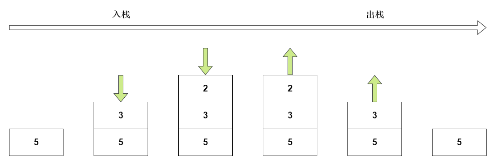
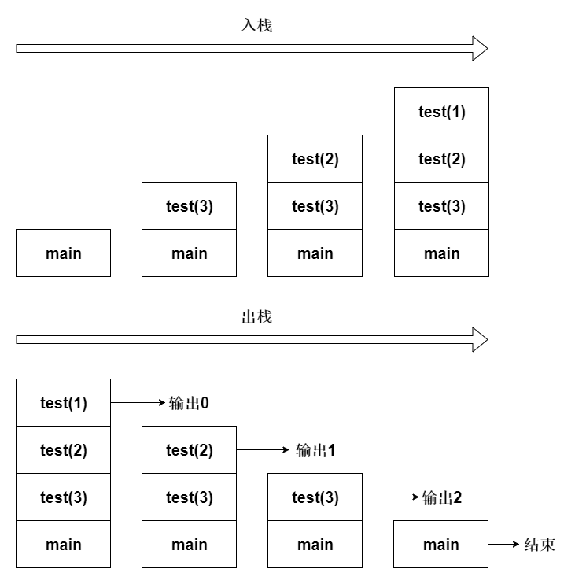

### 概述

栈是一种"先入后出"的数据结构。

### 存储方式



栈遵循先入后出的原则，栈只有两种操作，压入和弹出。

栈的顶部为称为栈顶，也就是数据压入和弹出的那一侧。栈的底部称为栈底，栈顶元素为离栈顶最近的元素，栈底元素为离栈底最近的元素。

栈可用数组和链表作为底层实现。

### 栈的应用

##### 调用栈

* 代码

``` java
public static void main(String[] args) {
    testOne();
}

public static void testOne() {
    testTwo();
    System.out.println("One");
}

public static void testTwo() {
    testThree();
    System.out.println("Two");
}

public static void testThree() {
    System.out.println("Three");
}
```

``` test
Three
Two
One
```

* 图解


##### 递归调用栈

* 代码

``` java
public static void main(String[] args) {
    test(3);
}

public static void test(int i) {
    System.out.println(--i);
    if (i > 0) {
        test(i);
    }
}
```

``` text
2
1
0
```

* 图解

