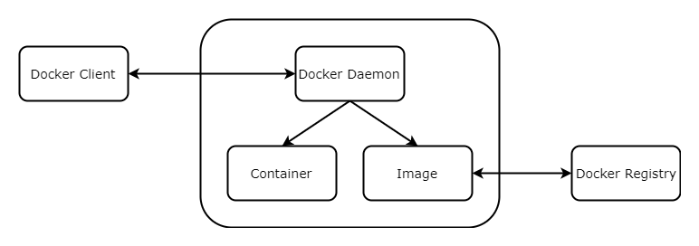

### Docker简述

Docker是一个开源的容器管理平台，采用了C/S模式。

### Docker 结构简图



##### Docker Client

发送Docker命令给Docker Daemon。

##### Docker Daemon

Docker Daemon接收Docker Client发过来的命令，并执行相应的操作。

##### Image

Image是构建Container的模板。其本身是应用及应用所需依赖的打包。

##### Container

Container是独立的应用。可以理解为对应用，应用数据，应用所需依赖的装箱处理，容器与容器之间是隔离的。

##### Docker Registry

Docker Registry提供Image相关托管服务，默认为Docker Hub。

### Docker与虚拟机区别

Docker轻量化，Docker只提供了应用所需的依赖，是进程级别的。

虚拟机建立在硬件的基础上，需要完全模拟一个操作系统，然后在操作系统中提供应用所需的依赖。

### Docker 常用命令

* 命令提示

``` shell
docker command --help
```

* 查看本机的所有image

``` shell
docker images
```

* 搜索image

``` shell
docker search centos
```

* 拉取image到本机

``` shell
docker pull centos

// 下载对应版本的centos image，默认为最新版本
docker pull centos:7
```

* 删除image

``` shell
// 删除image时，其对应的container需删除
// xxx为IMAGE ID
docker rmi xxx
```

* 查看本机的所有container

``` shell
docker ps -a
```

* 查看本机运行中container

``` shell
docker ps
```

* 创建container

``` shell
docker create centos
```

* 启动container

``` shell
// xxx为CONTAINER ID
docker start xxx
```

* 创建并启动container

``` shell
docker run centos

// 启用交互式container，退出后container即位停止状态
docker run -i -t centos /bin/bash
// -i 保持STDIN开启
// -t 分配一个伪TTY

// 后台运行container
docker run --name centos -d -i -t centos /bin/bash
docker run -d centos:7 /bin/sh -c "while true; do echo hello world; sleep 1; done"
// -d 后台运行container并打印container id
// -c CPU份额（相对权重）

// 端口映射 将8080端口映射到docker上的8080端口 IP地址为docker默认IP地址
docker run -p 8080:8080 tomcat
```

* 进入容器

``` shell
// 用该命令进入容器的各个窗口会同步显示
docker attach centos

docker exec -it centos /bin/bash
```

* 退出容器

``` shell
exit
```

* 查看docker默认IP地址

``` shell
docker-machine ip default
```

* 查看container日志

``` shell
// xxx为CONTAINER ID
docker logs xxx
```

* 停止container

``` shell
// 停止container
// xxx为CONTAINER ID
docker stop xxx

// 强制停止container
// xxx为CONTAINER ID
docker kill xxx
```

* 删除container

``` shell
// 不能删除正在运行的container
// xxx为CONTAINER ID
docker rm xxx
```