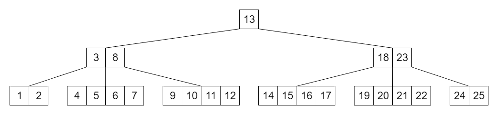
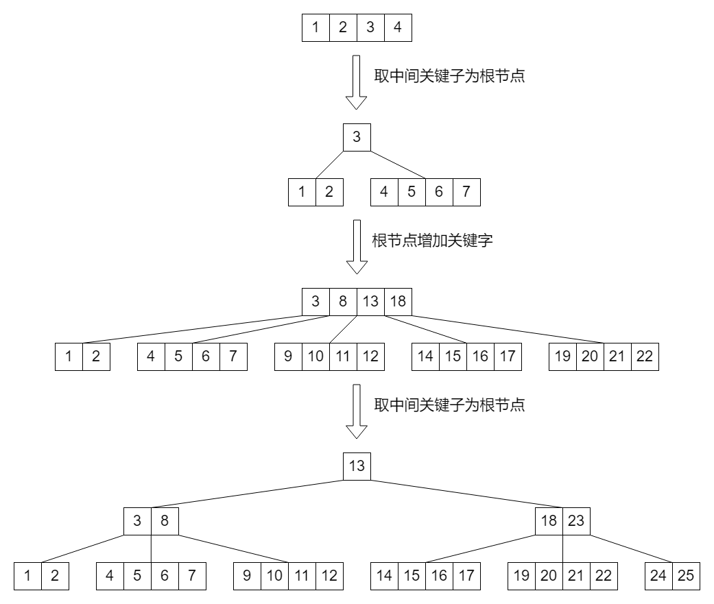
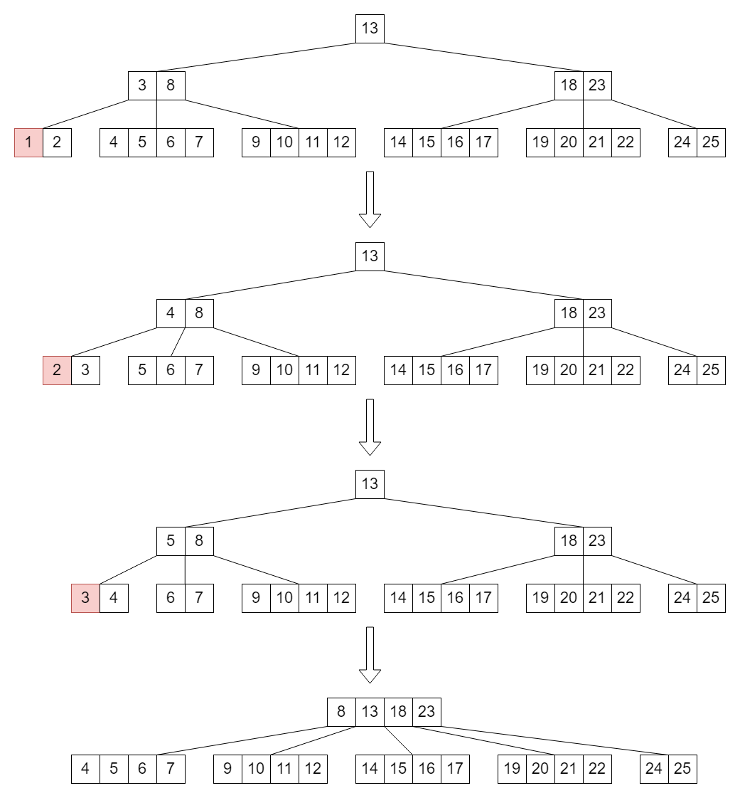

本文介绍了B树相关知识。内容仅供参考使用，有不足之处请及时指出，也欢迎大家交流探讨。

### 概述

B树英文名为B-tree（B是指Balance），因此又称B-树，B-树不能叫成B减树，除此之外，B树也叫平衡多路查找树。

B树是为了解决磁盘查找效率低的问题，平衡二叉查找树提高了树的查询效率，但是当数据很多存储在磁盘中时，平衡二叉查找树的高度很高，频繁的从磁盘中读取节点的数据会导致查询效率很低。

### B树结构

##### m阶B树

* 每个结点最多有m个子节点

* 根结点最少有2个子节点（除了B树只有一个节点的情况），除叶子节点外的其他结点最少有ceil(m/2)个子节点，ceil会返回大于括号值的最小整数

* 所有的叶节点在同一层，可以用空表示

* 有i个子节点的节点要有i-1个关键字，关键字按递增次序排序

##### 图示

### 操作

##### 插入

将1到25的整数作为关键字依次插入到一个5阶B树中。

##### 查询

在上述图示B树中查找16关键字。

* 16大于13，在13的右子树中查找

* 16小于18，在18的右子树中查找

* 查找到16

##### 删除

删除关键字涉及到向兄弟结点借关键字和合并。

