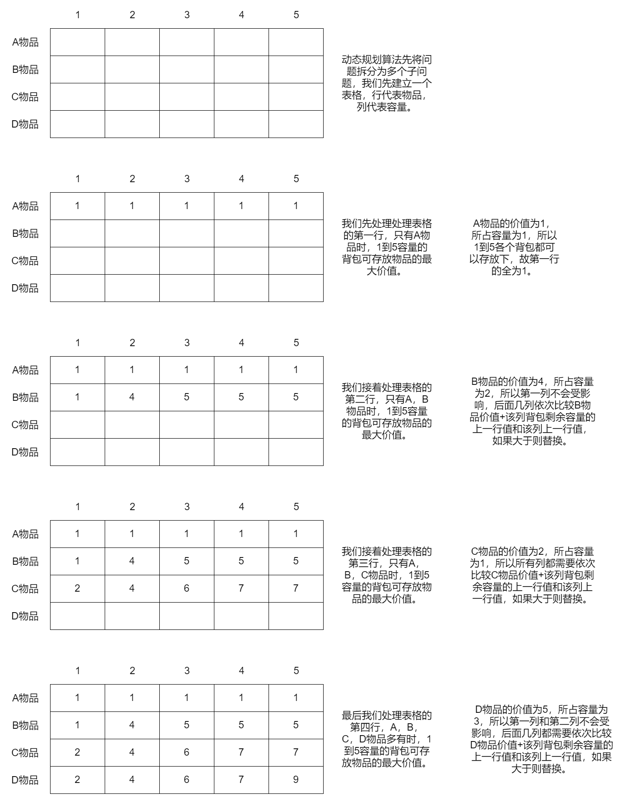
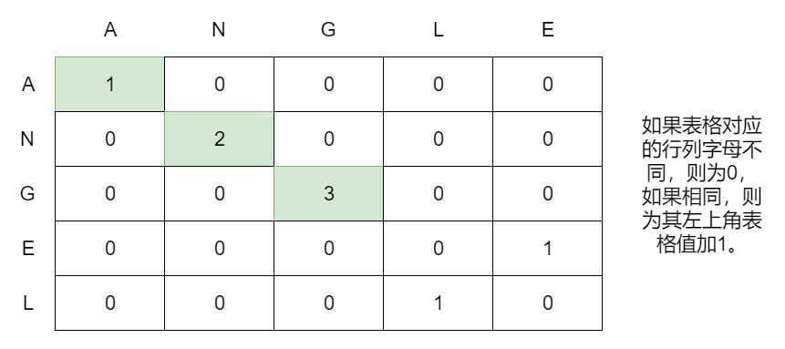
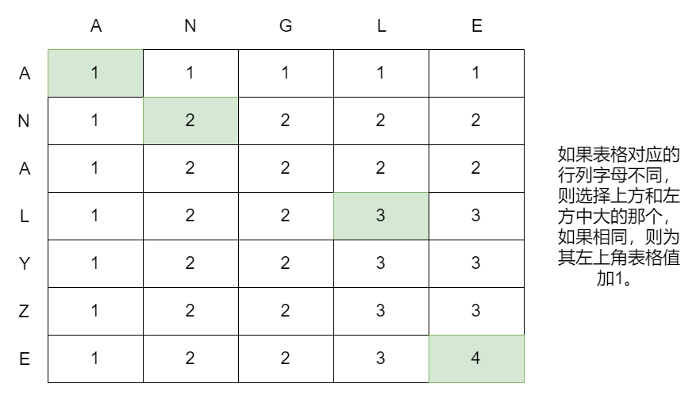

本文介绍了动态规划算法相关知识。内容仅供参考使用，有不足之处请及时指出，也欢迎大家交流探讨。

### 概述

动态规划算法会将任务拆分为多个离散子问题（子问题之间不存在依赖关系），然后从子问题开始，一步步解决子问题，进而解决问题。

动态规划算法离不开网格。

### 背包问题

5容量背包所装物品的最高价值。

##### 物品列表

|物品|价值|所占容量|
|:----|:----|:----|
|A物品|1|1|
|B物品|4|2|
|C物品|2|1|
|D物品|5|3|

##### 图示

由上图可知，5容量背包所装物品的最高价值为9。

### 最长公共子串

angle（角度）和angel（天使）的最长公共子串。

由上图可知，angle和angel的最长公共子串长度为3，最长公共子串为ANG。

### 最长公共子序列

angle（角度）和analyze（分析）的最长公共子序列。

由上图可知，angle和analyze的最长公共子序列长度为4，最长公共子序列为ANLE。