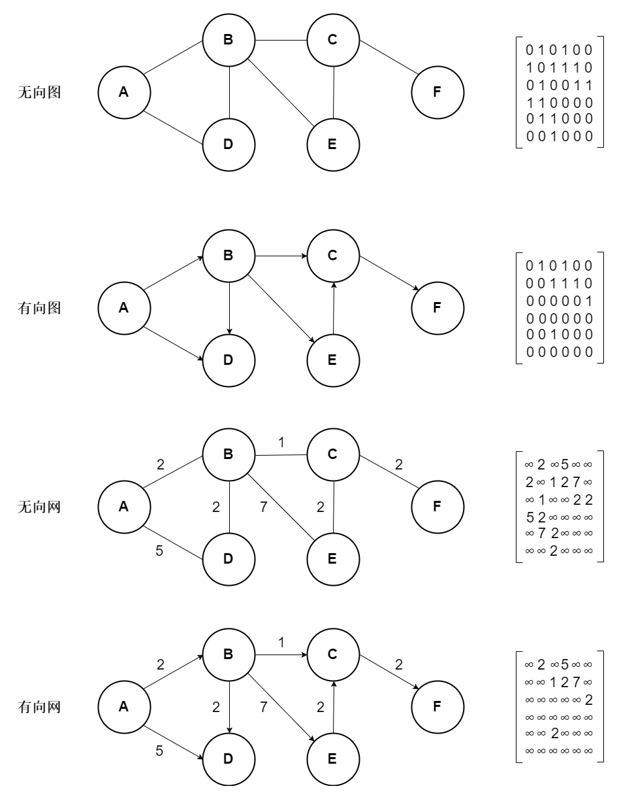
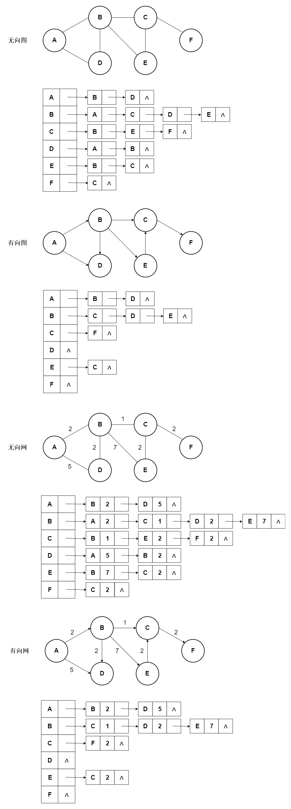

本文介绍了图基本知识。内容仅供参考使用，有不足之处请及时指出，也欢迎大家交流探讨。

### 概述

图是一种复杂的数据结构，其由顶点（节点，交点）和边（链接）组成，顶点之间通过边连接，边可以有方向和权重。

### 类型

* 有向图

图中的每条边都是有方向的。

* 无向图

图中的每条边都是无方向的。

* 完全图

图中的每个顶点与其他所有顶点都有边。

### 相关概念

##### 邻点

一个边两头的顶点称为邻点。

##### 度

顶点的度是指顶点相关联边的数量，在有向图中，度为出度和入度的和，入度是指以该顶点为终点的有向边的数量，出度是指以该顶点为起点的有向边的数量。

##### 网

带权值的图称为网。

##### 连通图

所有顶点相通的图称为连通图。

### 图的存储结构

##### 邻接矩阵

邻接矩阵通过矩阵表示图中顶点关系。

无向图邻接矩阵是对称的，有向图邻接矩阵不一定对称。

##### 邻接链表

邻接链表通过链表表示图中顶点关系。

无向图邻接链表是唯一的，有向图邻接链表有两种形式，正邻接链表，逆邻接链表，逆邻接链表与正邻接链表表示的相反，其存储的是与其不相邻的顶点。