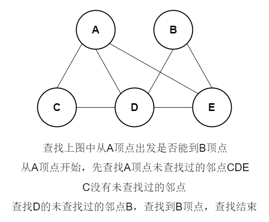

本文介绍了广度优先搜索相关知识。内容仅供参考使用，有不足之处请及时指出，也欢迎大家交流探讨。

### 概述

广度优先搜索是图查找算法，其英文名为Breadth First Search，简称BFS。

### 时间复杂度

O(V+E)，V为顶点数，E为边数。

### 图示



广度优先搜索也适用于无权图中查找两个顶点最短路径。

### 示例

查找上述图中从A顶点出发，是否能到B顶点和F顶点

``` java
public class Graph {

    // 顶点列表
    private List<String> vertexList;
    // 存储边
    private int[][] edges;
    // 边的个数
    private int edgeNums;

    public Graph(int vertexNums) {
        vertexList = new ArrayList<>(vertexNums);
        edges = new int[vertexNums][vertexNums];
        edgeNums = 0;
    }

    public int getVertexNums() {
        return vertexList.size();
    }

    public int getVertexIndex(String vertex) {
        return vertexList.indexOf(vertex);
    }

    public String getVertex(int vertexIndex) {
        return vertexList.get(vertexIndex);
    }

    public int[][] getEdges() {
        return edges;
    }

    public void addVertex(String vertex) {
        vertexList.add(vertex);
    }

    public void addEdge(int i, int j) {
        edgeNums++;
        edges[i][j] = 1;
    }
}
```

``` java
public static void main(String[] args) {

    Graph graph = new Graph(5);

    graph.addVertex("A");
    graph.addVertex("B");
    graph.addVertex("C");
    graph.addVertex("D");
    graph.addVertex("E");

    graph.addEdge(2, 0);
    graph.addEdge(3, 0);
    graph.addEdge(4, 0);
    graph.addEdge(3, 1);
    graph.addEdge(4, 1);
    graph.addEdge(0, 2);
    graph.addEdge(3, 2);
    graph.addEdge(0, 3);
    graph.addEdge(1, 3);
    graph.addEdge(2, 3);
    graph.addEdge(4, 3);
    graph.addEdge(0, 4);
    graph.addEdge(1, 4);
    graph.addEdge(3, 4);

    System.out.println(bfs(graph, "A", "B"));
    System.out.println(bfs(graph, "A", "F"));
}

public static boolean bfs(Graph graph, String startVertex, String endVertex) {

    Queue<String> queue = new LinkedList();
    Map<String, String> visited = new HashMap<>();
    queue.offer(startVertex);
    visited.put(startVertex, startVertex);

    while (queue.size() > 0) {

        String currentVertex = queue.poll();

        if (currentVertex.equals(endVertex)) {
            return true;
        }

        for (int i = 0; i < graph.getVertexNums(); i++) {
            if (1 == graph.getEdges()[i][graph.getVertexIndex(currentVertex)]) {

                String tempVertex = graph.getVertex(i);

                if (!visited.containsKey(tempVertex)) {
                    visited.put(tempVertex, tempVertex);
                    queue.offer(tempVertex);
                }
            }
        }
    }
    return false;
}
```

输出

``` text
true
false
```