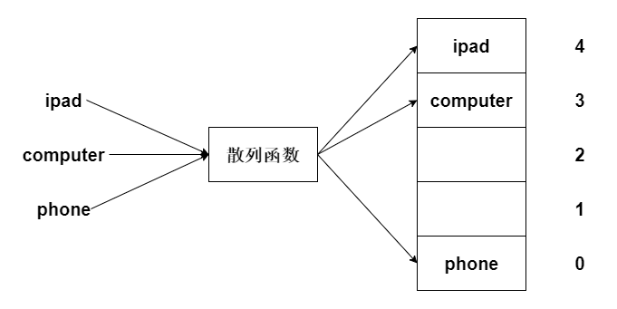
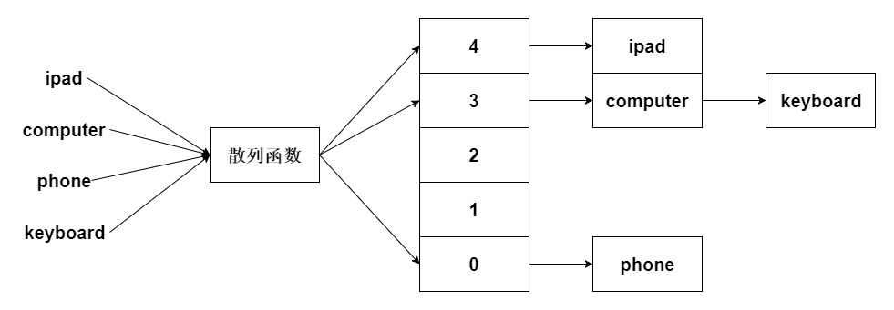

本文介绍了散列表基本知识。内容仅供参考使用，有不足之处请及时指出，也欢迎大家交流探讨。

### 概述

散列表是最有用的基本数据结构之一。

### 散列（hash）函数

散列函数是指将不同长度的输入处理为固定长度的输出的函数。

##### 特点

* 相同的输入得到的输出是相同的

* 输出不同输入一定不同

* 输出相同输入不一定相同

### 散列表

散列表是指使用散列函数处理后的值来确定数据存储位置的数据结构。

##### 示例

在商品清单中快速查找某一商品。

* 自定义散列函数

|输入|输出|
|:----|:----|
|商品名|商品名长度除以5的余数|

* 数组散列



* 说明

我们定义一个长度为5的数组。

在存储或读取一个字符串时，我们先使用自定义散列函数处理字符串，散列函数处理后的数字即为字符串存储的位置。

通过这种方式，可以快速定位数据存储的位置，保证了效率。

### 冲突

由哈希函数的特点可知，不同的字符串的散列值可能一样，这样就发生了冲突（碰撞），在上述示例中，keyboard会和computer会发生冲突。

散列表可以使用数组链表的结构来处理冲突。

##### 示例

在商品清单中快速查找某一商品。

* 自定义散列函数

|输入|输出|
|:----|:----|
|商品名|商品名长度除以5的余数|

* 数组链表散列



* 说明

我们定义一个长度为5的数组，数组存储的类型为链表。

当散列值一样的时候，其可以将值添加在链表中，这样即解决了哈希冲突的问题，又保证了效率。

### 性能

##### 填装因子

填装因子是用来衡量散列表中数组已用存储空间的。

``` text
填装因子=数组已用的出处空间/数组的总空间
```

一般情况下，散列表会判断填装因子，如果填装因子超过阀值（一般是0.7）散列表会进行扩容，其会调整自身数组的长度。

扩容虽然消耗较大，但总体来说散列表的效率还是很高的。

##### 分析

链表的查找效率并不是很高，所以链表的长度最好不要很长，因此优秀的散列函数应该使值尽量分散来，不要使值扎堆到一起。