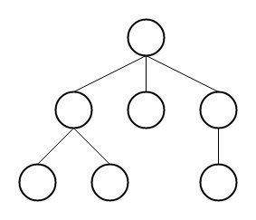
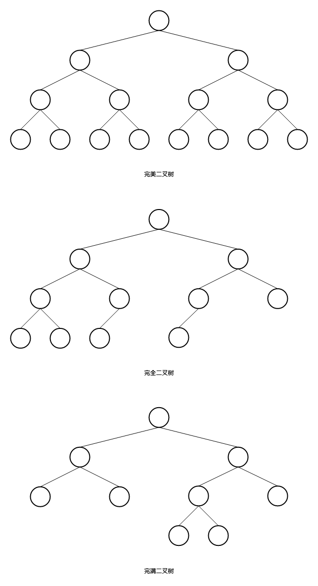

本文介绍了树基本知识。内容仅供参考使用，有不足之处请及时指出，也欢迎大家交流探讨。

### 概述

树是一种特殊的图，其形状类似一颗倒立的树。

树由节点和边组成，没有节点的树称为空树。

在非空树中，有且只有一个根（root）节点，每个节点有且只有一条与根节点相通的路径，每个节点可以通过边与其他节点连接。

### 相关概念

* 父节点，子节点

一个节点的邻点中，与根节点近的为其父节点，其他的为其子节点，除根节点外的每个节点只能有一个父节点，但可以有零个，一个或多个子节点。

* 兄弟节点

具有相同父节点的节点互为兄弟。

* 树叶（叶子节点）

没有子节点的节点。

* 深度

节点的深度是指根到这个节点的长度。

* 高

节点的高是指该节点到树叶到最长距离。

### 二叉树

二叉树是指每个节点最多拥有两个子节点的树。

* 完美二叉树（满二叉树）

除叶子节点外的节点都有两个子节点，且叶子节点的深度都相同。

* 完全二叉树

除最后一层外，其余满足完美二叉树，最后一层叶子节点靠左对齐。

* 完满二叉树

除叶子节点外的每个节点都有两个子节点。

##### 存储

二叉树可以使用链表存储。

##### 树的遍历

* 前序遍历

先遍历当前节点，再遍历左子节点，再遍历右子节点。

* 中序遍历

先遍历左子节点，再遍历当前节点，再遍历右子节点。

* 后续遍历

先遍历左子节点，再遍历右子节点，再遍历当前节点。