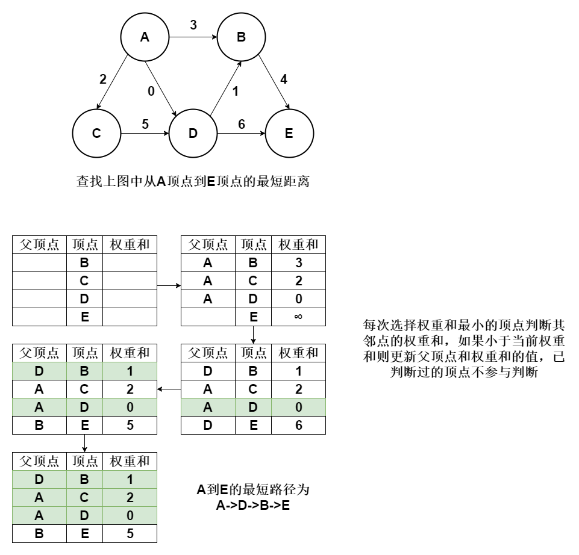

本文介绍了狄克斯特拉算法相关知识。内容仅供参考使用，有不足之处请及时指出，也欢迎大家交流探讨。

### 概述

狄克斯特拉（Dijkstra）算法是一种加权图中寻找两节点最短路径的算法。

狄克斯特拉算法适用于有向无环图（directed acyclic graph，DAG）且权重不能为负数。

### 图示



### 示例

查找上图中从A顶底到E顶点的最短距离

``` java
public class Graph {

    // 顶点列表
    private List<String> vertexList;
    // 存储边
    private int[][] edges;
    // 边的个数
    private int edgeNums;

    public Graph(int vertexNums) {
        vertexList = new ArrayList<>(vertexNums);
        edges = new int[vertexNums][vertexNums];
        edgeNums = 0;
        IntStream.range(0, vertexNums).forEach(i -> Arrays.fill(edges[i], Integer.MAX_VALUE));
    }

    public int getVertexNums() {
        return vertexList.size();
    }

    public int getVertexIndex(String vertex) {
        return vertexList.indexOf(vertex);
    }

    public List<String> getVertexList() {
        return vertexList;
    }

    public int[][] getEdges() {
        return edges;
    }

    public void addVertex(String vertex) {
        vertexList.add(vertex);
    }

    public void addEdge(int i, int j, int weight) {
        edgeNums++;
        edges[i][j] = weight;
    }
}
```

``` java
public class WeightRecord {

    private String fatherVertex;
    private String vertex;
    private int weight;

    public String getFatherVertex() {
        return fatherVertex;
    }

    public void setFatherVertex(String fatherVertex) {
        this.fatherVertex = fatherVertex;
    }

    public String getVertex() {
        return vertex;
    }

    public void setVertex(String vertex) {
        this.vertex = vertex;
    }

    public int getWeight() {
        return weight;
    }

    public void setWeight(int weight) {
        this.weight = weight;
    }
}
```

``` java
public static void main(String[] args) {

    Graph graph = new Graph(5);

    graph.addVertex("A");
    graph.addVertex("B");
    graph.addVertex("C");
    graph.addVertex("D");
    graph.addVertex("E");

    graph.addEdge(1, 0, 3);
    graph.addEdge(2, 0, 2);
    graph.addEdge(3, 0, 0);
    graph.addEdge(4, 1, 4);
    graph.addEdge(2, 2, 5);
    graph.addEdge(1, 3, 1);
    graph.addEdge(4, 3, 6);

    dijkstra(graph, "A", "E");
}

public static void dijkstra(Graph graph, String startVertex, String endVertex) {

    Map<String, WeightRecord> weightRecordMap = new HashMap<>();
    Set<String> unCheckSet = new HashSet<>();

    graph.getVertexList().forEach(vertex -> {

        if (!startVertex.equals(vertex)) {
            WeightRecord weightRecord = new WeightRecord();
            weightRecord.setVertex(vertex);
            weightRecord.setWeight(Integer.MAX_VALUE);
            weightRecordMap.put(vertex, weightRecord);
        }

        if (!startVertex.equals(vertex) && !endVertex.equals(vertex)) {
            unCheckSet.add(vertex);
        }
    });

    for (int i = 0; i < graph.getVertexNums(); i++) {

        int weight = graph.getEdges()[i][graph.getVertexIndex(startVertex)];
        if (weight != Integer.MAX_VALUE) {
            WeightRecord weightRecord = weightRecordMap.get(graph.getVertexList().get(i));
            weightRecord.setFatherVertex(startVertex);
            weightRecord.setWeight(weight);
        }
    }

    while (!unCheckSet.isEmpty()) {

        Set<String> vertexSet = weightRecordMap.keySet();
        Iterator iterator = vertexSet.iterator();
        int minWeight = Integer.MAX_VALUE;
        String minWeightVertex = "";

        while (iterator.hasNext()) {
            String vertex = iterator.next().toString();
            int tempWeight = weightRecordMap.get(vertex).getWeight();
            if (unCheckSet.contains(vertex) && minWeight > tempWeight) {
                minWeight = tempWeight;
                minWeightVertex = vertex;
            }
        }

        unCheckSet.remove(minWeightVertex);

        for (int i = 0; i < graph.getVertexNums(); i++) {

            int weight = graph.getEdges()[i][graph.getVertexIndex(minWeightVertex)];
            if (weight != Integer.MAX_VALUE) {
                WeightRecord weightRecord = weightRecordMap.get(graph.getVertexList().get(i));
                int minWeightVertexWeight = weightRecordMap.get(minWeightVertex).getWeight();
                if (weightRecord.getWeight() > weight + minWeightVertexWeight) {
                    weightRecord.setWeight(weight + minWeightVertexWeight);
                    weightRecord.setFatherVertex(minWeightVertex);
                }
            }
        }
    }

    if (weightRecordMap.get(endVertex).getWeight() == Integer.MAX_VALUE) {
        System.out.println("起始顶点无法到达结束顶点");
    }

    Stack<String> vertexStack = new Stack<>();
    String tempVertex = endVertex;
    while (!startVertex.equals(weightRecordMap.get(tempVertex).getFatherVertex())) {
        String tempFatherVertex = weightRecordMap.get(tempVertex).getFatherVertex();
        vertexStack.push(tempFatherVertex);
        tempVertex = tempFatherVertex;
    }

    System.out.println("起始顶点到结束顶点的最短路径为" + weightRecordMap.get(endVertex).getWeight());
    System.out.print(startVertex + "->");
    while (!vertexStack.empty()) {
        System.out.print(vertexStack.pop() + "->");
    }
    System.out.println(endVertex);
}
```

输出

``` text
起始顶点到结束顶点的最短路径为5
A->D->B->E
```