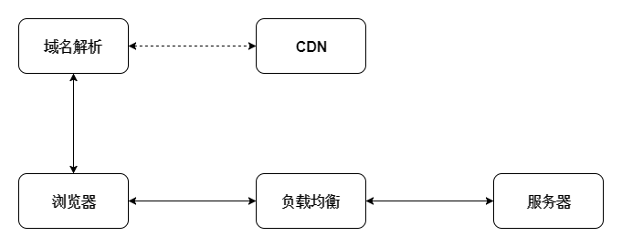

本文介绍了Web访问流程及相关技术。内容仅供参考使用，有不足之处请及时指出，也欢迎大家交流探讨。

### 概述

在如今社会中，网站已是我们获取信息，相互沟通，娱乐学习的重要途径，B/S结构在日常生活中已十分常见。

##### B/S优点

* B/S结构由于使用浏览器进行访问操作，极大的降低了使用的难度。

* 使用统一的HTTP协议，极大的降低了开发成本。

* 基于HTTP协议的服务器很多，Apache，IIS，Nginx，Tomcat，JBoss等。

##### HTTP协议优点

HTTP协议采用无状态短连接的通信方式，使得通信连接在传送完信息后得到快速的释放，进而服务更多的用户。

### 访问流程

### HTTP请求

一个HTTP请求的过程实际就是建立一个Socket通信的过程。

HTTP默认端口是80。

##### URL

URL（Uniform Resource Locators）统一资源定位器，我们通过URL在互联网中获取资源和提供服务。

##### HTTP格式

###### 请求格式

HTTP请求信息包含4个部分，请求行，请求头，空行，请求数据。

<table>
	<tr>
    	<td>请求方法 URL 协议版本</td>
        <td>请求行</td>
    </tr>
    <tr>
    	<td>头部字段名 值</td>
        <td rowspan = '3'>请求头</td>
    </tr>
    <tr>
    	<td>头部字段名 值</td>
    </tr>
    <tr>
    	<td>... ...</td>
    </tr>
    <tr>
    	<td colspan = '2'>空行</td>
    </tr>
    <tr>
    	<td colspan = '2'>请求数据</td>
    </tr>
</table>

###### HTTP常见请求头部字段名

|头部字段名|说明|
|:----|:----|
|Accept-Charset|客户端接收的字符集|
|Accept-Encoding|可接收的内容编码|
|Accept-Language|可接受语言|
|Host|主机和端口号|
|User-Agent|操作系统，浏览器等信息|
|Connection|连接状态 HTTP1.1默认为Keep-Alive|

###### 响应格式

响应格式包括4个部分，状态行，响应头，空行，响应数据。

<table>
	<tr>
    	<td>协议版本 状态码 状态码说明</td>
        <td>状态行</td>
    </tr>
    <tr>
    	<td>头部字段名 值</td>
        <td rowspan = '3'>响应头</td>
    </tr>
    <tr>
    	<td>头部字段名 值</td>
    </tr>
    <tr>
    	<td>... ...</td>
    </tr>
    <tr>
    	<td colspan = '2'>空行</td>
    </tr>
    <tr>
    	<td colspan = '2'>响应数据</td>
    </tr>
</table>

###### HTTP常见响应头部字段名

|头部字段名|说明|
|:----|:----|
|Server|服务器名称|
|Content-Type|响应数据格式|
|Content-Encoding|响应数据编码|
|Content-Language|响应数据语言|
|Content-Length|响应数据长度，以字节为单位的十进制个数|
|Keep-Alive|保持连接时间|

###### HTTP常见状态码

|状态码|说明|
|:----|:----|
|200|成功|
|302|重定向至Location指定的URL|
|400|请求语法错误，服务端解析失败|
|403|服务端收到请求但拒绝提供服务|
|404|请求的资源不存在|
|500|服务端发生不可预期的错误|
|503|服务端当前不能处理客户端的请求，过段时间服务端可能恢复正常|

##### 浏览器缓存机制

为了减少不必要的请求以提升效率并减少服务端的压力，浏览器有缓存功能，其会将一些信息数据缓存在浏览器中。

设置缓存属性的头部字段Cache-Control，Pragma。Cache-Control针对的是浏览器，Pragme针对的是服务端。

Expires是用来指定缓存失效时间的头部字段。

Last-Modified是用来表示服务器上资源修改的最新时间，在请求时会将该时间放入If-Modified-Since头部字段中，询问服务端现在缓存的资源是不是最新的。Etag是通过服务端给每个页面打一个版本号来区分文件是不是最新的。

### 域名解析

在实际生活中，为了方便记忆使用，我们往往使用的是域名，域名在使用时需要解析为对应的IP。

当我们输入域名进行访问时，会经历如下几个步骤。

1. 浏览器检查自己的DNS缓存是否有该域名解析的缓存（一张存储域名和域名对应IP地址的表），如果有则直接使用缓存，解析过程结束。浏览器的缓存时间可通过TTL属性设置，太长，太短都不好。

2. 操作系统检查自己的DNS缓冲是否有该域名的解析，如果有则直接使用，解析过程结束。

3. 检查hosts文件中是否维护该域名和IP的地址关系，如有则直接使用，解析过程结束。Windows系统中，操作系统本地解析文件存放位置为C:\Windows\System32\drivers\etc\hosts，Linux系统中，操作系统本地解析文件存放位置为/etc/hosts。

4. 如果本地没有解析该域名，那么需要访问域名服务器来解析域名，操作系统先会将该请求发送给LDNS（本地区的域名服务器），然后查看该服务器是否缓存了给域名的解析，如果有则直接使用，域名解析结束。
 
5. 本地域名服务器访问Root Server域名服务器请求解析，Root Server域名服务器会返回该域名对应的主域名服务器（gTLD Server）地址，gTLD是国际顶级域名服务器，全球有13台左右，对应com，cn，org等。

6. 本地域名服务器收到主域名服务器地址后，访问主服务器获取此域名对应的Name Server地址，Name Server地址通常指的是服务端注册的域名服务器。

7. 本地域名服务器获取到Name Server地址后，访问Name Server地址并获取该域名对应的信息，将其返回给请求方，并将该域名缓存。

8. 操作系统受到解析结果后将其告知浏览器，并缓存域名解析结果。

9. 浏览器获取解析结果并缓存域名解析结果

实际DNS解析过程中，解析步骤不一定完全如上所诉。Name Server可能有多级。

##### 查看域名解析命令

nslookup(linux和windows通用)

dig +trace (linux使用)

##### 清除缓存的域名

windows ipconfig /flushdns

linux /etc/init.d/nscd restart

##### JVM DNS缓存

JVM会通过InetAddress类缓存DNS解析结果，配置项在%JAVA_HOME%\lib\security\java.serurity文件中配置，也可以在JVM启动参数中配置-Dsun.net.inetaddr.ttl=xxx。

##### 域名解析方式

|方式|说明|
|:----|:----|
|A记录|可以将多个域名解析到一个IP地址，但是不能一个域名解析到多个IP地址|
|MX记录|表示是Mail Exchange|
|CNAME记录|可以为一个域名设置一个或多个别名|
|NS记录|为域名指定DNS解析服务器|
|TXT记录|为主机名或域名设置别名|

### CDN

CDN（Content Delivery Network）内容分发网络，其通过在现有的Internet中增加一层新的网络结构，将相关数据分布式的存放在各个节点中，是用户可以就近获取其所需要的数据，进而缓解源端压力，提高响应速度。

CDN使用时可以直接使用CDN域名，或者在权威DNS服务器（Name Server的最后一站，是实际存储相应域名信息的服务器）做映射，将域名解析到相应的CDN服务去，如果CDN节点不存在用户所需要的数据，那么用户会去源站获取数据。

### 负载均衡

负载均衡是对工作任务进行平衡分配，使其分摊到多个操作单元上执行。

##### 常见负载均衡架构

* 链路负载均衡

通过DNS解析实现。

* 集群负载均衡

硬件负载均衡（F5）和软件负载均衡。

* 操作系统负载均衡

利用操作系统级别的软中断或硬件中断来实现负载均衡。