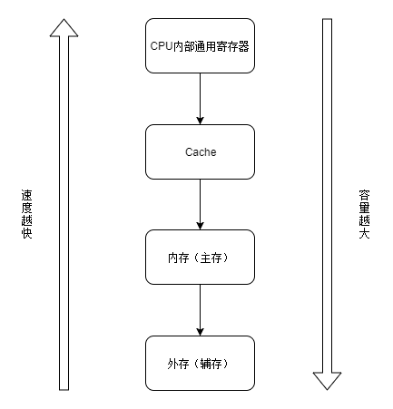

本文介绍了计算机组成基本知识。内容仅供参考使用，有不足之处请及时指出，也欢迎大家交流探讨。

### 计算机组成

计算机由硬件和软件组成，软硬件互相协同完成任务。

硬件由运算器，控制器，存储器，输入设备，输出设备组成，运算器和控制器集成在一起，统称为中央处理单元（Central Processing Unit，CPU）,存储器分为内部存储器和外部存储器，输入设备和输出设备统称为外部设备（外设）。

软件分为系统软件和应用软件，系统软件是保证计算机系统正确高效运行的基础软件，应用软件是为了解决相关应用领域问题而编制的程序。

### 中央处理单元

计算机系统的核心部件，获取，译码，执行程序指令。

##### CPU功能

* 程序控制

通过执行指令来控制程序的执行顺序。

* 操作控制

操作各个部件以满足指令的执行。

* 时间控制

对各种操作在时间上进行控制。

* 数据处理

数据的加工处理。

##### CPU组成

CPU主要由运算器，控制器，寄存器组，内部总线等部件组成。

* 运算器

运算器主要由算术逻辑单元（Arithmetic and Logic Unit，ALU），累加寄存器，数据缓存寄存器，状态条件寄存器组成。运算器主要负责执行算术，逻辑运算及逻辑测试，其受控制器指令的控制。

ALU是运算器重要的组成部件，负责数据的算术，逻辑运算。

累加寄存器（AC），累加器，是一个通用寄存器，其为ALU提供工作区，例如减法运算，先将被减数取出放置AC中，然后取出减数，然后和AC中的被减数做运算并将运算结果送回AC中，运算器至少要有一个AC。

数据缓存寄存器（DR），其作为CPU和内存，外部设备的缓存，其暂时存储指令或数据。

状态条件寄存器（PSW），其用来存储一些标志，主要分为状态标志，控制标志。

* 控制器

控制器主要由指令寄存器，程序计数器，地址寄存器，指令译码器组成，控制器保证程序的正确执行及异常的处理。

指令寄存器（IR），用来暂存指令，当CPU获取指令时，其会将其由内存储器移至缓存寄存器在移至IR暂存。

程序计数器（PC），寄存信息和计数，又称指令计数器，其存储的是将要执行的下一条指令的地址。

地址寄存器（AR），保存当前CPU所访问的内存单元的地址。

指令译码器（ID），分析解析指令的操作码，控制各部件完成工作。

控制器包括指令控制逻辑，时序控制逻辑，总线控制逻辑，中断控制逻辑等几个部分。

* 寄存器组

专用寄存器和通用寄存器。运算器和控制器中的寄存器属于专用寄存器，通用寄存器用途广泛，并可由程序控制，其数量不同处理器不一样。

##### 多核CPU

为了满足用户同时处理多个任务的需求以及提高计算机的性能，CPU往往会有多个内核。

### 存储系统

##### 层次结构



##### 存储器分类

###### 存储器所处位置分类

* 内存

内存是用来存放机器当前运行所需的程序和数据，位于主机内或主机板上。

* 外存

外存是用来存放不参加运行的信息，需要时再移入内存，例如磁盘，光盘，U盘。

###### 存储器构成材料分类

* 磁存储器

用磁性介质做成。

* 半导体存储器

根据所用元件划分为双极型和MOS型。

根据数据是否刷新分为静态和动态。

* 光存储器

利用光学方法读写数据的存储器。

###### 存储器工作方式分类

* 读写存储器 RAM

* 只读存储器

|名称|简写|说明|
|:----|:----|:----|
|固定只读存储器|ROM|生产时就已写好数据，不允许修改。|
|可编程的只读存储器|PROM|用户可以一次性的写入，写入后就不能修改。|
|可擦除可编程的只读存储器|EPROM|可以写入，也可以修改，利用紫外线照射擦除数据。|
|电擦除可编程的只读存储器|EEPROM|可以写入，也可以修改，利用电擦除数据。|
|闪速存储器|Flash Memory|闪存，特性类似于EEPROM，速度远快于EPROM。|

###### 存储器访问方式分类

* 按地址访问存储器

* 按内容访问存储器

###### 存储器寻址方式分类

* 随机存储器

* 顺序存储器

* 直接存储器

##### 相联存储器

按内容访问存储器，写入时，将数据或数据中的一部分数据作为关键字，读取时可根据关键字来获取对应单元的数据。

##### 缓存

缓存位于CPU和主存之间，其一定程度上弥补了CPU和主存读取速度的差距，极大的提高了计算机的速度。

###### 缓存地址映像方法

* 直接映像

* 全相联映像

* 组相联映像

###### 缓存命中率

当CPU要访问的数据在缓存中，即为缓存命中，否则则为没有命中。

###### 缓存存储器等效加权平局访问时间

```
耗时 = 缓存命中率 * 缓存存取时间 + (1 - 缓存命中率) * 主存存取时间
```

###### 多级缓存

多级缓存中，CPU优先访问排在前面的缓存，例如计算机有三级缓存，CPU优先在一级缓存查找，不命中则继续在二级缓存查找，二级缓存不命中则继续在三级缓存查找。

##### 虚拟存储器

虚拟存储是对主存进行了抽象，CPU访问时会访问虚拟地址，然后再通过使用专门的MMU（Memory Management Unit）将虚拟地址转换为物理地址后访问主存。

##### 常见外存储器

* 磁表面存储器

* 光盘存储器

* 固态硬盘

* U盘

##### 时间局部性/空间局部性

* 时间局部性

最近被访问过的单元，将来有可能还会被访问。

* 空间局部性

最近被访问过的单元，其附近的单元将来有可能被访问。

### 输入/输出设备

##### 输入/输出控制方式

无条件传送，中断，程序查询，DMA方式等。

DMA方式是在DMA控制器硬件的控制下实现数据传送，不需要CPU执行程序指令。

##### 输入设备

键盘，鼠标，扫描仪等。

##### 输出设备

显示器，打印机等。

### 总线

总线（Bus）是计算机各设备之间传输信息的公共数据通道。

##### 数据总线

双向传送数据信息。

##### 地址总线

单向传送CPU发出的地址信息。

##### 控制总线

双向传送控制信号，时序信号和状态信息等。

##### 常见总线

ISA总线，EISA总线，PCI总线，PCI Express总线，SATA，USB，IEEE-488总线等。